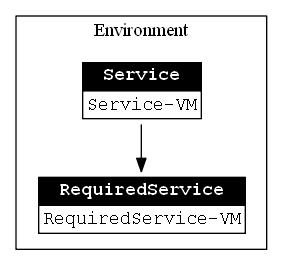

# What is a VM-Topology

A VM-Topology is a [custom PowerShell class](classes/Class-VMTopology.md) containing different elements. It is __build from all virtual machines of one host which contain a [Tag](TheTag.md) in their notes field__.

It can contain multiple [VM-Environments](classes/Class-VMEnvironment.md) in which virtual machines can provide [VM-Services](classes/Class-VMService.md). The environment also reflect the dependencies between these services.

## Example Graph

These graph shows a simple VM-Topology containing one environment, one service provided by one VM and one required service provided by one VM.

## How to use a VM-Topology with other commands?

You can use the VM-Topology to select virtual machines by VM-Service or VM-Environment and use them with commands like `Export-VM`.

For example to export all virtual machines from the VM-Environment _LAB_ on the _localhost_ use the following:

    Export-VM -VM ((Get-VMTopology).Environment | where-object -property name -eq 'LAB').VM